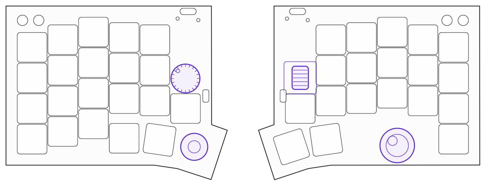

  <picture>
    <source media="(prefers-color-scheme: dark)" srcset="docs/readme-logo-white.png">
    
  </picture>

  左右分割・完全無線のロープロファイルキーボードです。 
  右手にトラックボール、左手にスティックを載せていて、 
  ホームポジションから手を大きく動かさないまま、打つ・指す・回すができます。

  

## 取扱説明書・カラーシミュレーター・arare Studio

ブラウザで開くだけの3つのページです。**アカウント登録もインストールも要りません。実機が手元になくても開けます。**

<table>
<tr>
<td align="center" width="33%">
 
<a href="https://amearare54.github.io/arare/manual.html"><b>MANUAL</b></a> 
どんなキーボードか知る
</td>
<td align="center" width="33%">
 
<a href="https://amearare54.github.io/arare/colorsim.html"><b>COLOR SIMULATOR</b></a> 
色を決めるとき
</td>
<td align="center" width="33%">
 
<a href="https://amearare54.github.io/arare/"><b>STUDIO</b></a> 
キーを変えたくなったら
</td>
</tr>
</table>

> [!TIP]
> リンクが開けないときは、こちらから直接どうぞ。
> MANUAL <https://amearare54.github.io/arare/manual.html> ／
> COLOR SIMULATOR <https://amearare54.github.io/arare/colorsim.html> ／
> STUDIO <https://amearare54.github.io/arare/>
>
> arare Studio で実機につないで書き換える機能だけ、Chrome / Edge が必要です。
> 取扱説明書は開いたときに短い演出（4.6秒）が流れますが、クリックなどでいつでも飛ばせます。

ZMK の設定・ピン割当・ビルドを見に来た方は [技術情報](#技術情報) へどうぞ。

## arare でできること

| | できること |
|---|---|
| 右手・トラックボール | &#216;19 mm の光学センサー式。指で転がしてポインタを動かします。 |
| 右手・ホイール | 軸は左右方向で、前後に転がします（マウスのスクロールホイールと同じ向き）。出荷時は回すとページ送り、押し込みで左クリック。 |
| 左手・ノブ | 軸は上向きで、ボリュームつまみのように水平に回します。出荷時は回すと音量、押し込みで &#8679;&#8984;V。 |
| 左手・スティック | トラックパッドの代わりとして載せています。2 本指・3 本指でするような操作を、親指ひとつでできるように、というつもりです。倒す操作（アナログ入力）は準備中で、いまは押し込みのみ有効です。 |
| 完全無線 | 左右それぞれに電池とマイコンがあり、間をつなぐケーブルがありません。残量はマイコンのランプが色で知らせます。 |
| ホットスワップ | Kailh Choc v2 互換のキースイッチを、はんだ付けなしで差し替えられます。 |
| キーマップ | ブラウザから何度でも変えられます（[arare Studio](https://amearare54.github.io/arare/)）。 |

## まず見てほしいもの

**1. 大きさと各部を見る** → [取扱説明書の「各部の名称」](https://amearare54.github.io/arare/manual.html#parts)

平面図・側面図・正面図に寸法を入れた総組立図を載せています。コンセプト、はじめかた、出荷時のキーマップ、名前の由来、仕様・お手入れ・安全にお使いいただくために、なども入っています。

**2. 色を決める** → [カラーシミュレーターを開く](https://amearare54.github.io/arare/colorsim.html)

ケースは3Dプリントなので、部品ごとに色を選べます。実機と同じ3Dデータをブラウザに載せていて、クリア樹脂の見えかたも再現します。EXPLODE で分解図、AUTO でゆっくり回しながら確かめられます。

**3. キー配列を見る** → [arare Studio を開く](https://amearare54.github.io/arare/)

実機がなくても、配置図の上でキーの割り当てを触ってみられます。

## 使いはじめる

1. **電源を入れる** — 左右それぞれの側面にあるスライドスイッチを内側（ON）へ。左右とも忘れずに。
2. **パソコンとつなぐ** — Bluetooth の一覧から `arare` を選びます。一覧に出るのは右手側だけで、左手側は右手側と自動でつながります。
3. **キーの割り当てを変える** — 書き換える前に、内側のタクトスイッチ（UNLOCK）を一回押します。→ [arare Studio](https://amearare54.github.io/arare/)

### ランプの見かた

USB-C のとなりに、同じ大きさの小さな穴が2つあります。片方がマイコン基板のリセットスイッチ、もう片方がランプです（どちらがどちらかは [取扱説明書の各部の名称](https://amearare54.github.io/arare/manual.html#parts) の図で確かめられます）。

ランプは電池残量を色で知らせます。ふだんは消えています。

| 色 | 残量 |
|---|---|
| 緑 | 60 % 以上 |
| 橙 | 20 % より上、60 % 未満 |
| 赤 | 20 % 以下 |

電源を入れたときと、しばらく置いてから使いはじめたときに 1.5 秒だけ点きます。残量が 20 % 以下になると赤く2回点滅して以降5分ごと、10 % 以下になると赤く3回点滅して以降2分ごとに知らせます。**点滅するのは使っているあいだだけで、置きっぱなしのときと充電中は光りません。** USB-C をつないでいるあいだは、残量の色が点いたままになります。

> [!TIP]
> つながらないとき、充電のしかた、接続先の切り替えは、[取扱説明書の「はじめかた」](https://amearare54.github.io/arare/manual.html#start) にまとめています。

## 仕様

| 項目 | 内容 |
|---|---|
| 方式 | 左右分割・Bluetooth LE 接続（ZMK ファームウェア） |
| キー数 | 実キー40（左21／右19）＋エンコーダー押し込み2／スティック押し込み1／タクトスイッチ4（計47ポジション） |
| 本体サイズ | 片手あたり 122.5 &#215; 96.4 mm ／ 高さ 23.8 mm（右）・28.1 mm（左・ノブ含む） |
| キーピッチ | 17 &#215; 17 mm |
| キースイッチ | Kailh Choc v2 互換・ホットスワップ |
| ポインティング | 19 mm トラックボール（光学センサー・PAW3222）／ TMR 磁気式スティック |
| ロータリー | 縦型ノブ（左・水平に回す）／ 横型ホイール（右・前後に転がす）各1、押し込み付き |
| マイコン | Seeed XIAO nRF52840 &#215;2（技適取得済みモジュール・central は右手） |
| 電源 | リチウムポリマー電池（左右各1）／ USB-C 充電 |
| ケース | 3Dプリント・ガスケットマウント構造 |
| 対応 | Bluetooth LE キーボードとして動作する機器（macOS / Windows / iOS / iPadOS / Android など） |
| 編集ツール | arare Studio（ブラウザ）／ ZMK Studio 互換 |

## このリポジトリにあるもの

| もの | 場所 | 条件 |
|---|---|---|
| 3つのページの実体 | [`docs/`](docs/) | 公開 |
| ファームウェア（ZMK設定） | [`config/`](config/) | 公開 |
| 電池残量ランプの自前モジュール | [`src/battery_led.c`](src/battery_led.c) / [`Kconfig`](Kconfig) / [`CMakeLists.txt`](CMakeLists.txt) | 公開 |
| ケース・プレート・ノブ等の3Dプリントデータ | [`model/case/`](model/case/) | 個人使用のみ |
| ロゴ（SVG / PNG / DXF / STL） | [`model/logo/`](model/logo/) | 個人使用のみ |

> [!IMPORTANT]
> `model/` の3Dデータとロゴは、個人使用のみにとどめてください。再配布・商用利用はご遠慮ください（→ [model/README.md](model/README.md)）。
> カラーシミュレーターに埋め込まれている3Dデータも同じ条件です。

**まだ公開していないもの**

- 基板データ（KiCad / ガーバー）
- キーキャップの3Dデータ

基板データが非公開のため、ここに公開しているデータだけで1台を組み上げることはできません。

**これからやること**

- スティックのアナログXY入力
- DYA Studio のフル対応
- 深いスリープ（現在は無効）

理由は [技術情報](#技術情報)の「いまできないこと」に書いています。

## 技術情報

- ZMK v0.3.0 / ボードは `seeeduino_xiao_ble` &#215;2、central = 右手
- マトリクスは charlieplex 6線
- トラックボールは PAW3222。ドライバは sekigon-gonnoc/zmk-driver-paw3222（torabo-tsuki ブランチ）
- ZMK Studio 対応（central = 右手に USB 接続して <https://zmk.studio/> でも使えます）。アンロックキー＝各手内側のタクトSW、外側＝その手のリセット
- ピン割当とマトリクス定義は、非公開の基板データ（KiCad）と機械照合しています

### ビルドと書き込み

1. push すると GitHub Actions がビルドします（`arare_R`＝Studio snippet 付き / `arare_L` / `settings_reset`）
2. Actions の Artifacts から UF2 をダウンロードします
3. XIAO を BOOT モード（リセット2度押し）にすると、USB ドライブとして見えます
4. UF2 をそこにコピーすると書き込まれます

書き込みは左右それぞれに必要です。

> [!WARNING]
> 設定がおかしくなったときは、左右それぞれに `settings_reset` を書き込んでから、`arare_R` / `arare_L` を書き直してください。`settings_reset` を書き込んだままではキーボードとして動きません。

ピン割当とマトリクス

| | 左手 (peripheral) | 右手 (**central**) |
|---|---|---|
| ボード | seeeduino_xiao_ble | seeeduino_xiao_ble |
| マトリクス | charlieplex 6線 (M0=D0 M1=D1 M2=D6 M3=D7 M4=D8 M5=D9) | charlieplex 6線 (M0..M5=D0..D5) |
| エンコーダ | EC12縦 (D2/D3) 押込=Shift+Cmd+V | CKW12横 (D6/D7) 押込=左クリック |
| ポインタ | スティック押込=D10直結キー（アナログXYは未実装） | PAW3222 (spi1: SCK=P1.13 SDIO=P1.14 CS=P1.15 MOTION=P0.09) |

電池残量ランプは `CONFIG_ARARE_BATTERY_LED` で有効にする自前モジュールです（`zephyr/module.yml` から `Kconfig` と `CMakeLists.txt` を読み込み、`src/battery_led.c` をビルドします）。しきい値・点灯時間・警告間隔は `Kconfig` で変えられます。

いまできないこと（フェーズ2・既知の制約）

- **スティックのアナログXY**: badjeff/zmk-analog-input-driver を使う予定ですが、ZMK 本体のバッテリー計測が SAADC oversampling=4 をハードコードしており、併用すると約1分でハングする既知問題があります（ZMK フォークで oversampling=0 にするか、左手の電池報告を無効にする必要があります）。
- **DYA Studio フル対応**: キーマップ編集は公式 ZMK Studio 対応のまま DYA Studio からも使えます。トラックボール調整等のフル機能には cormoran/zmk フォーク＋モジュール4点が必要です（experimental 宣言あり）。
- **深いスリープ（`CONFIG_ZMK_SLEEP`）**: charlieplex が割込を持てず復帰不能なため、無効のままです。電源は物理スイッチで切ります。

## 名前のこと

「感謝感激雨あられ」の **あられ** から取りました。世に出ている良いキーボードの設計を参考にさせていただいたことへの**感謝**と、使ってくださる方に**感激**してほしいという願いを、そのまま名前にしています。

ロゴの文字には、和の気象の意匠が彫ってあります。霞・雨・波紋・しずく。遠目にはただの文字ですが、近づくと天気が見えてきます。表記は小文字の arare で通しています。

## 利用条件

- `config/` `src/` `Kconfig` `CMakeLists.txt` `zephyr/` のファームウェアと `docs/` のページ … 公開しています。参照や、ご自身の arare 用のビルドにお使いいただけます
- `model/case/` `model/logo/` の3Dデータとロゴ … 個人使用のみ。再配布・商用利用はご遠慮ください（→ [model/README.md](model/README.md)）
- 基板データ（KiCad / ガーバー）、キーキャップの3Dデータ … 非公開です

気づいたことや質問は Issues へどうぞ。

---

  <a href="https://amearare54.github.io/arare/manual.html">MANUAL</a> ・
  <a href="https://amearare54.github.io/arare/colorsim.html">COLOR SIMULATOR</a> ・
  <a href="https://amearare54.github.io/arare/">STUDIO</a>

